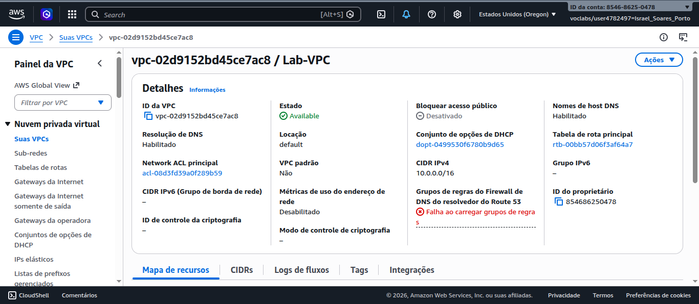
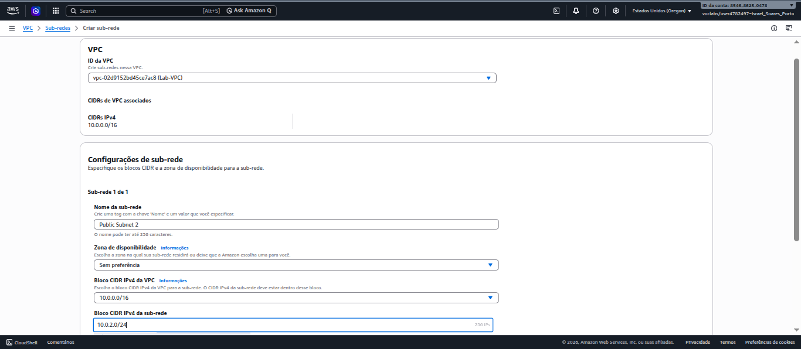
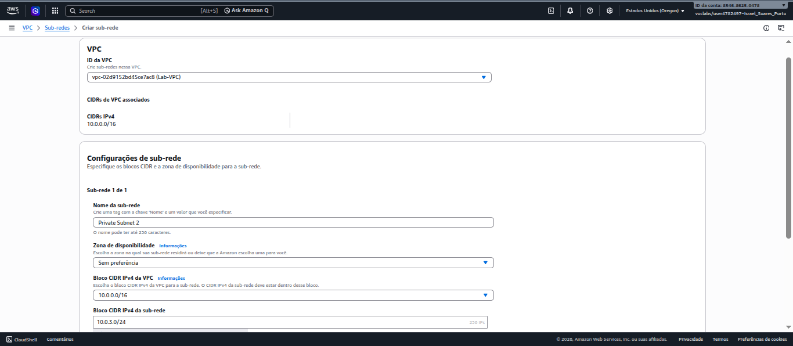
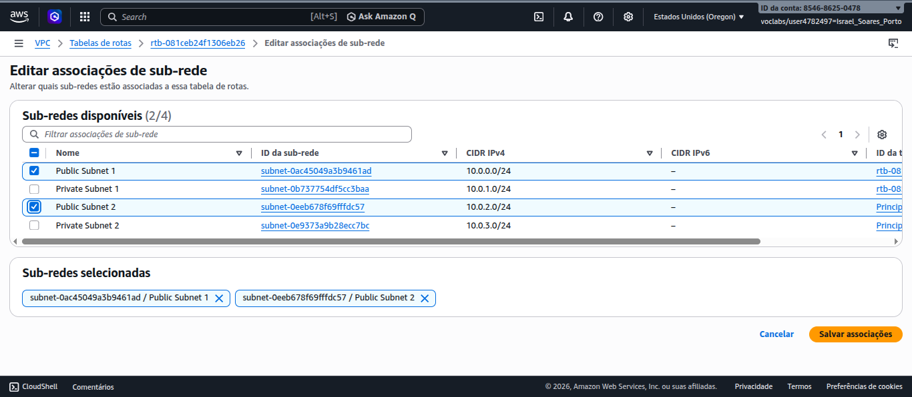
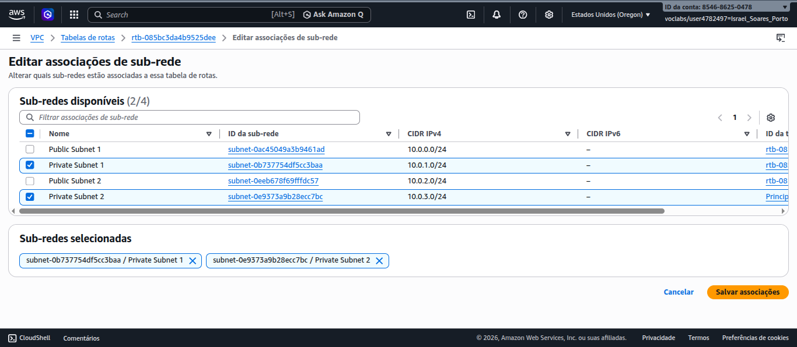
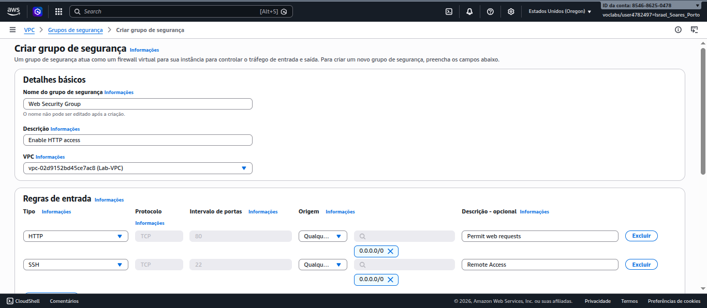
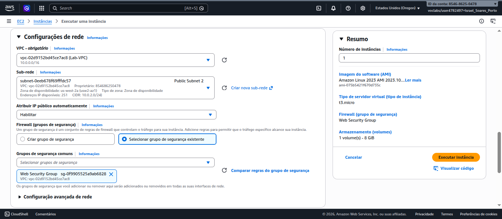
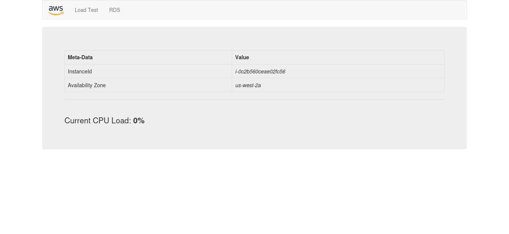
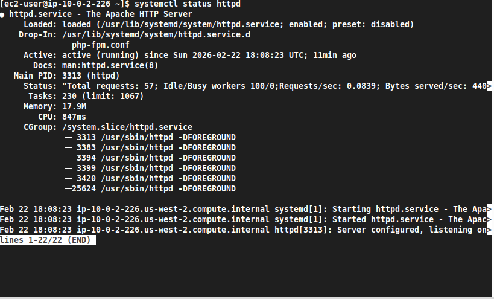

# Laboratório: Criação de VPC e Inicialização de Servidor Web

Neste laboratório prático, demonstra a criação de uma infraestrutura de rede personalizada na AWS (Amazon Web Services). O processo abrange desde a configuração de uma Virtual Private Cloud (VPC) até o lançamento de um servidor web funcional acessível publicamente.

## Objetivos

- Criar e configurar uma VPC (Virtual Private Cloud).
- Provisionar sub-redes públicas e privadas em diferentes Zonas de Disponibilidade.
- Configurar Tabelas de Rotas para gerenciar o tráfego de rede.
- Criar Grupos de Segurança para controlar o acesso de entrada e saída.
- Lançar uma instância EC2 e implantar um servidor web Apache com PHP.

## Arquitetura


A arquitetura consiste em uma **VPC** isolada (`10.0.0.0/16`) contendo sub-redes públicas e privadas. O tráfego de internet é roteado através de um **Internet Gateway** para as sub-redes públicas. Um **Grupo de Segurança** atua como firewall virtual, permitindo tráfego HTTP e SSH para a instância **EC2**, que hospeda a aplicação web.

## 1. Configuração da VPC

### 1.1 Criar a VPC Base

Nesta etapa, provisionei a estrutura fundamental da rede utilizando a opção "VPC e muito mais".

1. Acessei o console da VPC e inicio a criação de uma nova VPC.
2. Defini o bloco CIDR IPv4 como `10.0.0.0/16`.
3. Configuro inicialmente **1 Zona de Disponibilidade (AZ)**, **1 Sub-rede Pública** e **1 Sub-rede Privada**.
4. Personalizei os blocos CIDR das sub-redes:
    - Pública: `10.0.0.0/24`
    - Privada: `10.0.1.0/24`
5. Defini os nomes dos recursos (VPC, Subnets e Route Tables) conforme o padrão do projeto para facilitar a identificação.



## 2. Expansão da Rede

### 2.1 Criar Sub-redes Adicionais

Para aumentar a disponibilidade e segmentação, crio sub-redes adicionais manualmente.

1. Criei uma segunda **Sub-rede Pública** (`Public Subnet 2`) com o CIDR `10.0.2.0/24`.


2. Criei uma segunda **Sub-rede Privada** (`Private Subnet 2`) com o CIDR `10.0.3.0/24`.


### 2.2 Associar Tabelas de Rotas

As novas sub-redes devem ser associadas às tabelas de rotas corretas para garantir o fluxo de tráfego adequado (acesso à internet para públicas, isolamento para privadas).

1. Na **Tabela de Rotas Pública**, associo a `Public Subnet 2`.


2. Na **Tabela de Rotas Privada**, associo a `Private Subnet 2`.


## 3. Segurança

### 3.1 Configurar Grupo de Segurança

O Grupo de Segurança funciona como um firewall stateful para controlar o tráfego para a instância.

1. Crio um Grupo de Segurança denominado `Web Security Group`.
2. Adiciono regras de entrada (Inbound Rules):
    - **HTTP (80)**: Permitido de `Anywhere-IPv4` (0.0.0.0/0) para acesso web.
    - **SSH (22)**: Permitido de `Anywhere-IPv4` para administração remota.



## 4. Servidor Web

### 4.1 Lançar Instância EC2

A etapa final envolve o provisionamento do servidor e a instalação automática do software necessário via User Data.

1. Inicio uma instância **Amazon Linux 2** do tipo `t3.micro`.
2. Nas configurações de rede, seleciono a **Lab VPC** e a **Public Subnet 2**.
3. Habilito a atribuição automática de **IP Público**.
4. Associo o `Web Security Group` criado anteriormente.


5. Nos **Detalhes Avançados**, insiro o script de **User Data** para instalar o Apache (httpd), PHP e baixar a aplicação de laboratório.

```bash
#!/bin/bash
set -e

yum update -y

yum install -y httpd php unzip wget

wget https://aws-tc-largeobjects.s3.us-west-2.amazonaws.com/CUR-TF-100-RESTRT-1/267-lab-NF-build-vpc-web-server/s3/lab-app.zip

unzip lab-app.zip -d /var/www/html/

chown -R apache:apache /var/www/html/

systemctl start httpd
systemctl enable httpd
```

### 4.2 Validação

Após a instância passar nas verificações de status:

1. Copio o endereço **DNS IPv4 Público** da instância.

2. Acesso o endereço em um navegador para visualizar a aplicação web implantada.


3. Depois, acesso o terminal da instância via SSH para verificar os logs do Apache e confirmar que a aplicação está funcionando corretamente.


## Conclusões e Aprendizados

Este laboratório demonstrou a importância de uma arquitetura de rede bem estruturada no AWS. A criação de uma VPC com sub-redes públicas e privadas, associadas às tabelas de rotas corretas, permite um controle eficaz do tráfego de rede e melhora a segurança dos recursos implantados.

- **VPC**: Fundamental para isolar recursos e controlar o tráfego.
- **Sub-redes**: Permitem segmentação e controle de acesso.
- **Grupos de Segurança**: Essenciais para proteger as instâncias e controlar o acesso.
- **User Data**: Facilita a automação da configuração de instâncias, garantindo que os servidores estejam prontos para uso imediatamente após o lançamento.
